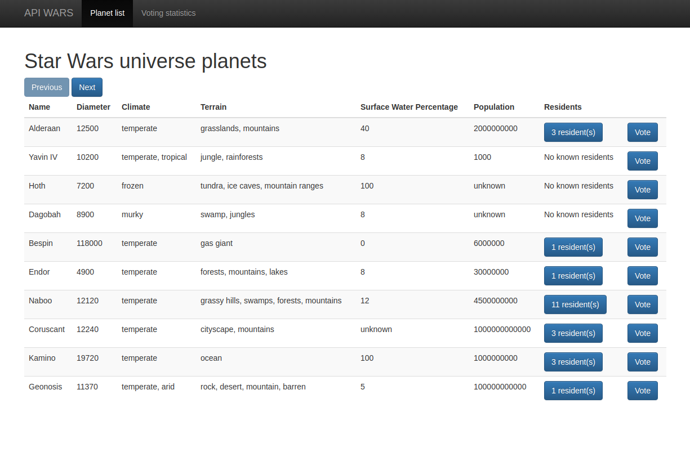
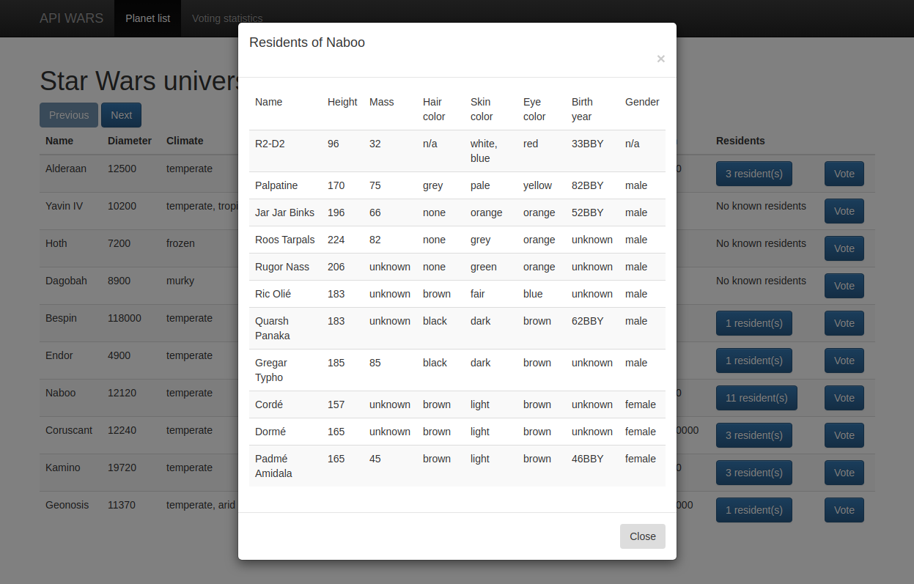

# API-Wars
A small project which was made as my JavaScript practice to get more experience using both internal and external web APIs. All the HTML markup is generated from the scripts to make it more dynamic and work like single-page application.

## Screenshots

1. Planet list view:

2. Residents list view:

## Tech Stack
- Python
- Flask
- JavaScript
- PostgreSQL

## Goals
The purpose of this project was to practice following subjects:
- REST API,
- handling data fetching and promises,
- handling HTTP requests depending on HTTP methods,
- asynchronous request handling,
- manipulating DOM from scripts,
- integration with database,
- SQL.

## Implemented Features
- fetch planets from `https://swapi.co/`,
- display planets in a table,
- create buttons to navigate between records,
- button triggering planet's residents modal,
- planet voting.

## Setup
- create a database,
- open `sql_commands` file and run the SQL command from its content to create a table `votes`,
- create the following environment variables to establish connection with the database: 
  - `PSQL_USER_NAME`,
  - `PSQL_PASSWORD`,
  - `PSQL_HOST`,
  - `PSQL_DB_NAME`,
 - install packages from `requirements.txt`.
